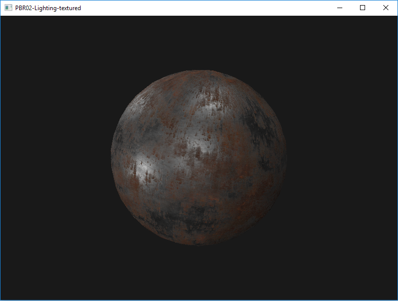

# OpenGLPBR

Physically-based rendering implementation based on OpenGL 3.3+

# Environment
Win10, VS2017, OpenGL 3.3+

# Projects

* __PBR01-Lighting__: physically based rendering with plain material
* __PBR02-Lighting-textured__: physically based rendering with textured material
* __PBR03-IBL-diffuse__: diffuse part of image-based lighting
* __PBR04-IBL-specular__: specular part of image-based lighting

# Build & Run
Open OpenGLPBR.sln in VS2017, press F5 to build & run one of the projects as a Win32 window application:

https://www.youtube.com/watch?v=dDbY8KeLm9I

# Dependencies

* [HDRLoader](http://flipcode.com/archives/HDR_Image_Reader.shtml)
* [glm](https://github.com/g-truc/glm) 
* [LodePNG](https://lodev.org/lodepng/)
* [GLEW](https://github.com/nigels-com/glew)

All dependencies have already been included in the repo.