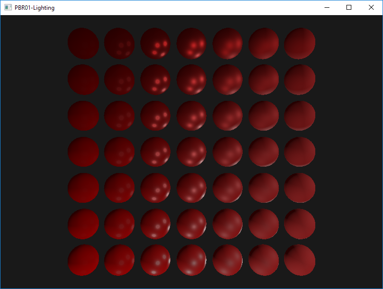

# OpenGLPBR

Physically-based rendering implementation based on OpenGL 3.3

# Environment
Win10, VS2017, OpenGL 3.3

# Build & Run
Open OpenGLOutline.sln in VS2017, press F5 to build & run one of the projects as a Win32 window application:

https://www.youtube.com/watch?v=dDbY8KeLm9I
